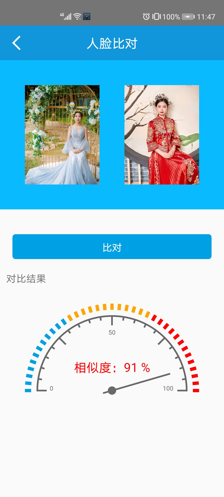
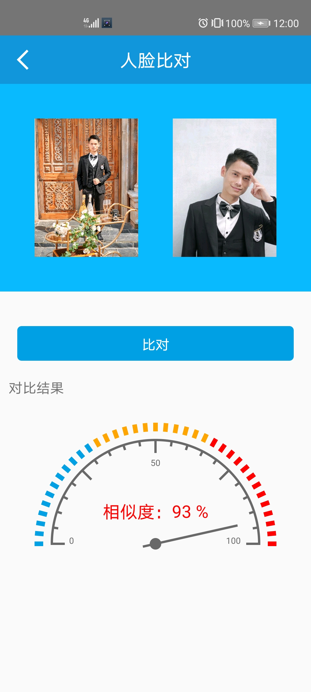

# FaceCompare
一款基于虹软人脸识别SDK实现的人脸1V1比对Demo,支持拍照，相册选择照片，可对选中的两张人脸图片进行比对，得到相似度。

# 示例图片
 

# 备注
  1.当前Demo未走动态权限申请，使用时请手动再手机设置中开启app需要的权限。
  2.若提示激活失败，请自行前往虹软 https://ai.arcsoft.com.cn/product/arcface.html 创建应用并将虹软SDK的APP_ID和SDK_KEY配置到com.cg.base.utils.Constant类中。
